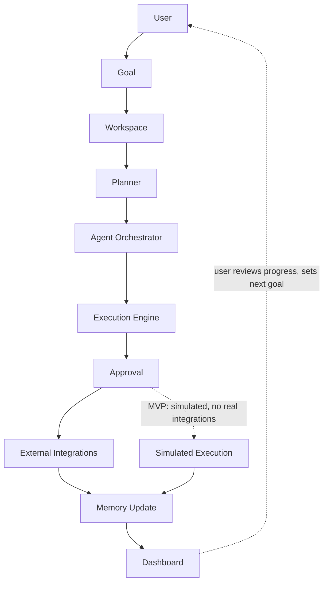
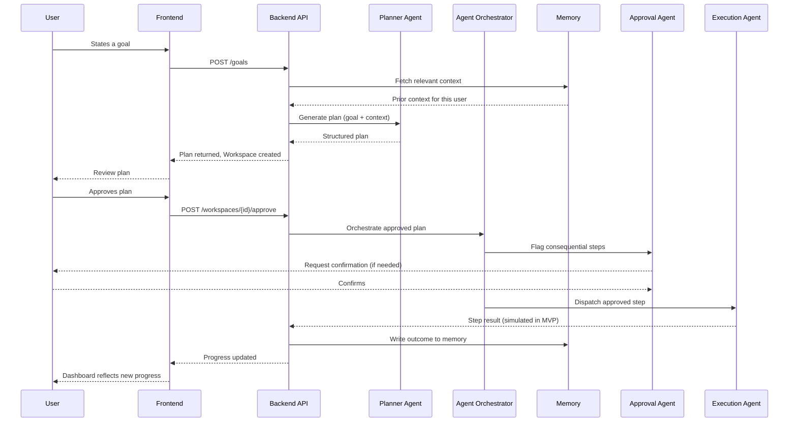

# LifeOS — Architecture

## Overall flow



**Note on the Approval step's position:** approval happens *before*
anything with real consequences runs — Agent Orchestration produces a
proposed set of actions, Approval gates them, and only approved actions
reach Execution/External Integrations. In the MVP, "External
Integrations" is replaced entirely by **Simulated Execution** (see
`docs/mvp_scope.md`) so the full loop can be validated without building
real integration adapters yet.

## Stage-by-stage responsibilities

- **User** — states a goal in plain language, and approves/rejects
  proposed actions at the Approval gate.
- **Goal** — the atomic unit of intent. Immutable once created (edits
  create a revised plan, not a silently mutated goal).
- **Workspace** — created by the Goal, holds every artifact tied to
  pursuing it: Tasks, Documents, Conversations, Memories, AI Plans,
  Progress, Agents.
- **Planner** — converts the Goal into a structured plan (ordered steps,
  dependencies). Backed by the Planner Agent.
- **Agent Orchestrator** — routes plan steps to the specialized agent
  responsible for each (Research for information-gathering steps,
  Execution for action steps, etc.), and manages handoffs between them.
- **Execution Engine** — carries out orchestrated, approved steps.
  Simulated in the MVP; will call real External Integrations in future
  versions.
- **Approval** — a hard gate before consequential actions. The Approval
  Agent decides what counts as "consequential" and surfaces it clearly to
  the user (see `docs/agents.md`).
- **External Integrations** — third-party systems the Execution Engine
  acts on in production (Gmail, Slack, Jira, calendars, banking, booking
  systems). Explicitly out of scope for the MVP.
- **Memory Update** — every completed step, decision, and outcome is
  written back to memory so future Planning and Orchestration are
  informed by real history, not a blank slate.
- **Dashboard** — surfaces progress across all of a user's Workspaces:
  what's planned, what's pending approval, what's done, what changed.

## Request lifecycle (example: goal creation to first execution step)



## Backend module map

```
backend/app/
├── api/            Route handlers only - thin, no business logic. Maps
│                   HTTP requests to the modules below.
├── core/            App-wide config (env-driven settings, no hardcoded
│                   values - see app/core/config.py).
├── database/         SQLAlchemy engine/session setup.
├── models/            ORM models (Goal, Workspace, Task, Plan, etc. -
│                   not yet implemented).
├── schemas/           Pydantic request/response schemas.
├── services/          Cross-cutting business logic that doesn't belong
│                   to one specific agent (e.g. auth, shared utilities).
├── planner/           Planning logic/algorithms. Wrapped by the Planner
│                   Agent for orchestration.
├── execution/          Execution/task-sequencing logic. Wrapped by the
│                   Execution Agent.
├── memory/            Business logic for what gets remembered and how
│                   it's retrieved. Wrapped by the Memory Agent. Distinct
│                   from vectorstore/ (the low-level embeddings backend).
├── research/           Logic for gathering supporting information.
│                   Wrapped by the Research Agent.
├── workspaces/         Workspace domain logic (creation, lifecycle,
│                   access).
├── agents/            Orchestration-facing agent definitions (thin
│                   coordinators over the modules above). See
│                   docs/agents.md.
├── integrations/       External system adapters. Empty until post-MVP -
│                   see docs/mvp_scope.md.
└── vectorstore/         Vector DB interface (Chroma today, swappable
                    later). Infra-level, used by memory/.
```

This keeps a hard separation between **routing** (`api/`), **capability
logic** (`planner/`, `execution/`, `memory/`, `workspaces/`), and
**orchestration** (`agents/`) — a step in the pipeline should never need
to touch `api/` directly, which is what lets the Agent Orchestrator
compose these pieces without every agent needing to know about HTTP.

## Frontend module map

```
frontend/
├── app/              Next.js App Router pages (routing only).
├── components/         Shared, reusable UI components (no
│                   feature-specific logic).
├── features/           Feature-scoped UI + logic, one folder per major
│                   product surface:
│   ├── workspace/       Workspace shell/nav + Overview (implemented).
│   ├── planner/          Goal input, plan review UI (placeholder).
│   ├── memory/           Inspectable memory surface (placeholder).
│   ├── agents/           Agent activity/status, approval prompts (placeholder).
│   └── dashboard/         Authenticated home - cross-workspace progress (implemented).
├── services/            Typed API client wrappers (builds on lib/api.ts).
├── hooks/              Shared React hooks used across features.
├── types/              Shared TypeScript types for core domain objects.
└── lib/               Low-level utilities: API fetcher, plus shared
                    display helpers (format.ts, goal-status.ts) so the
                    same status/date logic isn't redefined per component.
```

`features/` mirrors the backend's domain split (workspace, planner,
memory, agents) so a developer working on one concern can find the
matching code on both sides of the stack without translation.

## Workspace Overview: design rationale

The Workspace nav (`WorkspaceShell.tsx`) has exactly six tabs: Overview,
Tasks, Planner, Knowledge, Timeline, Chat. Mission and Progress are
**not** separate tabs, and this is intentional rather than an
oversight to revisit later.

Mission and Progress are views onto the parent **Goal's** own data
(`title`/`description`, `status`, `progress`, `created_at`/`updated_at`)
- they have no independent lifecycle, no data of their own beyond what
the Goal already stores, and nothing a user would ever navigate to "by
itself." Giving them dedicated tabs would fragment a single "how is this
goal doing" picture across clicks for no architectural or user benefit -
a violation of `docs/product_principles.md` Principle 5 (Simplicity Over
Complexity). Instead, `OverviewSection.tsx` is the goal's dashboard:
Mission, Progress, Goal Status, Created/Updated dates, a curated Recent
Activity summary, and placeholders for Upcoming Milestones and AI
Suggestions all live there together.

This also clarifies a distinction worth documenting: **Recent Activity**
(inside `OverviewSection.tsx`) is a small, curated summary - today it
lists exactly what we genuinely know happened (goal and workspace
creation) plus what's coming next. **Activity Timeline**
(`ActivityTimeline.tsx`) is reserved for the real, chronological event
log (task completions, check-ins, planner updates, knowledge updates,
execution history) and is honestly empty ("No activity yet.") until
those events exist as real, trackable data - it does not synthesize
placeholder entries the way Recent Activity's static list does, because
a timeline implies a real sequence of events and a fake one would be
actively misleading.

## Design principles carried forward from Day 1

- **Env-driven configuration only** — no hardcoded values, all settings
  flow through `app/core/config.py` (backend) and `NEXT_PUBLIC_*` env
  vars (frontend).
- **Thin routes, real logic in services/modules** — unchanged from Day 1,
  now extended to the planner/execution/memory/workspaces split above.
- **Every module independently replaceable** — the vectorstore can move
  from Chroma to pgvector without touching `memory/`; a real integration
  can replace simulated execution without touching `agents/execution_agent.py`'s
  interface.
