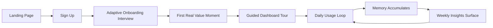
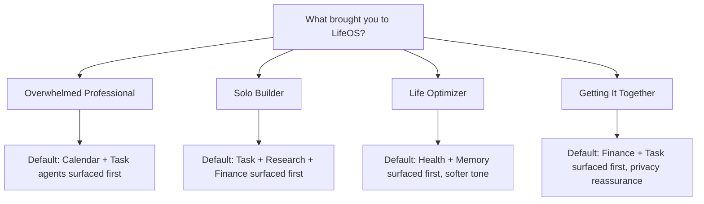
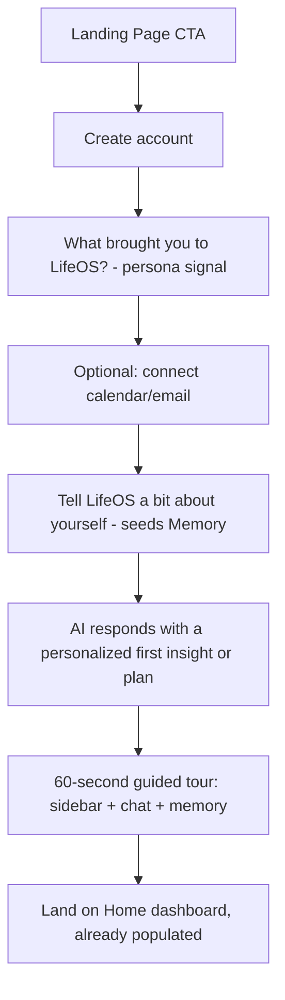

# LifeOS — Product Design Blueprint (Day 2)

> **⚠ Legacy document — superseded by the Day 3 pivot.**
> This was written under the original "AI Life Navigator" vision (a broad
> personal-life assistant covering journaling, habits, finance, health as
> parallel equal-weight agents). LifeOS has since pivoted to be an
> **Agentic Execution Operating System** centered on Goal → Workspace →
> Planner → Agent Orchestration → Approval → Execution → Memory Update.
> See `docs/vision.md`, `docs/architecture.md`, and `docs/mvp_scope.md`
> for the current source of truth. This file is kept for historical
> reference (persona-research and layout-pattern thinking here may still
> be reusable) but should not be treated as current product direction.

**Status:** Design phase. No production code today — this document is the reference every future UI decision should trace back to.

---

## 1. Complete User Journey

The journey has five stages. Each stage has one job — don't let it try to do two.

**Stage 1 — Discovery (Landing page).**
A visitor arrives skeptical (they've seen "AI productivity app" pitches before). The landing page's only job is to answer "what is this, and why is it different from a to-do app with a chatbot bolted on" in under 10 seconds. Hero statement, one live-feeling product visual (not a stock photo), three core capabilities (Memory, Planning, Agents), one CTA: "Start with LifeOS."

**Stage 2 — Onboarding (Signup → first value).**
Account creation, then a short adaptive interview (persona detection), then one real, useful action happens before the user ever sees an empty dashboard. Empty dashboards kill retention — the user must leave onboarding having *already* gotten something (e.g., their week visualized, or a first memory captured).

**Stage 3 — Orientation (First dashboard visit).**
A guided but skippable tour of the sidebar and home dashboard. Explains where agents live, where memory lives, and how to talk to the AI directly.

**Stage 4 — Daily usage loop.**
User opens LifeOS → sees a daily brief (what matters today) → interacts with one or more agents (task, calendar, finance, etc.) either directly or through the AI chat → LifeOS logs relevant context to memory automatically → user leaves.

**Stage 5 — Compounding value (Weekly/monthly return).**
Over time, LifeOS surfaces patterns ("you've rescheduled this task 4 times," "your spending on X is up 20%") that a stateless tool never could. This is the retention engine — the product gets more useful the longer it's used, and the UI needs to *show* that growth (e.g., a lightweight "LifeOS has learned..." surface), or the user won't perceive the value accruing.



---

## 2. User Personas & Adaptive Onboarding

Four personas, chosen because they stress different parts of the system (agents used, tone needed, data sensitivity).

**Persona A — "The Overwhelmed Professional."**
Manager/exec juggling meetings, tasks, and email overload. Primary need: calendar + task agents, meeting prep. Wants speed and delegation, low patience for setup friction. Onboarding for this persona should default to calendar connection first and skip anything not immediately actionable.

**Persona B — "The Solo Builder."**
Founder/indie hacker running projects solo. Needs task + coding + research + finance agents. Comfortable with power-user features (keyboard shortcuts, raw data views) early. Onboarding can go deeper technically without losing them.

**Persona C — "The Life Optimizer."**
Journals, tracks habits and health, wants gentle structure, not corporate productivity-speak. Needs health + memory + task agents, in a softer tone. Onboarding should ask about goals/habits, not "connect your calendar."

**Persona D — "The Getting-It-Together Student/Early Career."**
Needs finance (budgeting) + task + calendar, is price- and trust-sensitive, may be a first-time user of any AI-driven planning tool. Onboarding needs extra reassurance about privacy and low commitment (no forced calendar/bank connection up front).

**How onboarding adapts:** after account creation, one screen asks "What brought you to LifeOS today?" with persona-flavored options (not literally named to the user — framed as goals: "Get my week under control," "Run my own thing without dropping balls," "Build better daily habits," "Get my money and time organized"). The answer re-orders which agents are surfaced first, which sample prompts are shown, and the tone of the AI's first message. Nothing is hidden or locked — this only affects *default emphasis*, never access, because a Solo Builder might still want the Health agent later.



---

## 3. Information Architecture & Sidebar Navigation

Principle: the sidebar represents **agents and memory**, not features. This matches your own architecture (Rule 3/4 — specialized, collaborating agents) — the UI should mirror the system's real shape, not hide it behind generic labels like "Tools."

```
LifeOS
├── Home                (daily brief / dashboard)
├── Chat                (direct AI conversation, all agents accessible here too)
├── ── Agents ──
├── Tasks               (Task Agent)
├── Calendar             (Calendar Agent)
├── Meetings             (Meeting Agent)
├── Finance              (Finance Agent)
├── Health               (Health Agent)
├── Research             (Research Agent)
├── ── ──
├── Memory               (what LifeOS knows about you — viewable, editable, deletable)
├── ── ──
├── Settings             (account, connections, privacy, agent preferences)
```

Rules for this structure:
- **Home and Chat are always pinned** at the top — everything else can be reordered or hidden by the user (Settings → Customize sidebar).
- Agents a persona doesn't use yet are shown collapsed/greyed but never removed — discoverability matters more than a falsely "clean" list.
- **Memory gets its own top-level entry**, not buried in Settings, because Rule 2 ("memory first, everything contextual") means the user needs to trust and audit what's remembered — hiding it erodes that trust.

---

## 4. Home Dashboard Layout

The dashboard answers one question: **"What do I need to know or do right now?"** — not "here is all your data."

```
┌─────────────────────────────────────────────────────────────────┐
│  Sidebar │  Good morning, Krishna.              [ Ask LifeOS ]  │
│          │  Tuesday, July 15 · 3 meetings · 5 tasks due today   │
│  Home    ├───────────────────────────────────────────────────────┤
│  Chat    │  TODAY                                                │
│  ─────   │  ┌─────────────┐ ┌─────────────┐ ┌─────────────┐      │
│  Tasks   │  │ 9:00 Standup│ │ Finish spec │ │ $312 spent  │      │
│  Calendar│  │ 2:00 1:1    │ │ Review PR   │ │ this week   │      │
│  Meetings│  │ 4:30 Demo   │ │ Pay rent    │ │ (budget ok) │      │
│  Finance │  └─────────────┘ └─────────────┘ └─────────────┘      │
│  Health  │   Calendar          Tasks           Finance           │
│  Research│                                                       │
│  ─────   ├───────────────────────────────────────────────────────┤
│  Memory  │  LIFEOS NOTICED                                       │
│  ─────   │  "You've moved 'Finish spec' 3 times. Want to break   │
│  Settings│   it into smaller steps, or block focus time today?"  │
│          ├───────────────────────────────────────────────────────┤
│          │  QUICK ACTIONS                                        │
│          │  [+ Add task]  [+ Log expense]  [Ask about my week]   │
└─────────────────────────────────────────────────────────────────┘
```

Four zones, top to bottom, in priority order: **greeting + day summary** (orientation), **today's cross-agent snapshot** (calendar/tasks/finance cards — only the agents relevant to the user's day, not all seven), **a single proactive insight** (never more than one at a time — this is where "memory" becomes visible value, not a wall of notifications), **quick actions** (low-friction entry points that don't require opening a full agent screen).

---

## 5. Onboarding Flow



Design notes per step:
- **Persona question (C)** takes 5 seconds — single-select, big tappable cards, no forced essay answers.
- **Connect calendar/email (D) is explicitly optional and skippable.** Forcing an account connection before trust is earned is the #1 onboarding drop-off cause in this category. If skipped, LifeOS still works using manually-entered tasks/events.
- **"Tell LifeOS about yourself" (E)** is a free-text or voice box, not a form. This is the first real interaction with the Memory system — it should feel like talking to an assistant, not filling out a profile.
- **Step F is the "aha moment."** The AI should immediately reflect back something specific from what the user just said ("Got it — since you mentioned juggling client calls and a side project, I'll keep Calendar and Tasks front and center for you"). Generic responses here kill trust in the memory promise.
- **Tour (G) must be skippable with one click**, and re-accessible later from Settings — never force a returning power user through it.

---

## 6. AI Interaction Philosophy

LifeOS's AI is not a chatbot bolted onto a dashboard — it's meant to feel like a **capable chief-of-staff**, not a search engine and not a hype-man. Five principles:

1. **Concise by default, expansive on request.** The AI leads with the shortest useful answer and offers to go deeper ("Want the full breakdown?") rather than dumping paragraphs. Matches how a good human assistant communicates — headline first, detail on demand.

2. **Proactive, not intrusive.** The AI is allowed to surface one insight unprompted (the "LifeOS noticed" pattern on the dashboard), but never stacks multiple unsolicited messages. One nudge, clearly dismissible, never a notification barrage.

3. **Transparent about memory.** Whenever the AI uses remembered context to make a decision, it says so briefly ("since you usually skip lunch on meeting-heavy days, I moved this to tomorrow"). This single behavior is what separates LifeOS from a stateless assistant in the user's mind — it must never be silent about *why* it did something.

4. **Confirms before consequential actions.** Anything reversible-but-annoying (rescheduling, creating a task) can happen quietly. Anything with real stakes (sending an email, moving money, deleting data) always gets an explicit confirmation step — no silent agent-to-agent side effects the user didn't approve.

5. **Adaptive tone, consistent honesty.** Tone shifts by persona (brisk and efficient for the Overwhelmed Professional, warmer and more encouraging for the Life Optimizer) but the AI never inflates good news or softens bad news (a missed deadline is stated plainly, not spun). Trust is the whole product; a chief-of-staff who sugarcoats isn't useful.

---

## 7 & 8. Wireframes and Design Rationale (Major Screens)

### 7.1 Landing Page

```
┌───────────────────────────────────────────────────────────┐
│  LifeOS                                    [Log in] [Try] │
├───────────────────────────────────────────────────────────┤
│                                                             │
│        Your life, with an AI that actually remembers.      │
│                                                             │
│   [ live-feeling product snapshot: dashboard preview ]      │
│                                                             │
│   MEMORY          PLANNING          AGENTS                 │
│   Remembers what   Adapts your day  Specialists that       │
│   matters, not     around what's    collaborate, not one   │
│   every message.    actually true.   generic chatbot.      │
│                                                             │
│                  [ Start with LifeOS ]                      │
└───────────────────────────────────────────────────────────┘
```
**Rationale:** One CTA, not three. Three value pillars, not a feature list of twelve — matches Rule 1 ("every feature must solve a real problem," which also means every *marketing claim* should map to a real, demoable capability, not aspiration).

### 7.2 Sidebar + Chat (the AI's home screen)

```
┌──────────┬──────────────────────────────────────────────┐
│ Home     │  Chat                                         │
│ Chat ●   │ ┌──────────────────────────────────────────┐ │
│ Tasks    │ │ You: what's on my plate this week?         │ │
│ Calendar │ │                                              │ │
│ Meetings │ │ LifeOS: 3 things stand out —                │ │
│ Finance  │ │  • Spec doc due Thu (moved twice already)   │ │
│ Health   │ │  • Client renewal call Wed 2pm               │ │
│ Research │ │  • Rent due Fri (budget's fine)              │ │
│ ──────   │ │                                              │ │
│ Memory   │ │ Want me to block focus time for the spec?   │ │
│ ──────   │ └──────────────────────────────────────────┘ │
│ Settings │  [ Type a message...                    ➤ ] │
└──────────┴──────────────────────────────────────────────┘
```
**Rationale:** Chat is not a separate "AI feature" — it's a peer to every agent screen and can see/act across all of them, which is the whole point of collaborating agents (Rule 4). The active section indicator (●) keeps orientation clear even though chat can pull from anywhere.

### 7.3 Task Agent Screen

```
┌──────────┬──────────────────────────────────────────────┐
│ Sidebar  │  Tasks                          [+ New task]  │
│          │ ┌──────────────────────────────────────────┐ │
│          │ │ TODAY                                     │ │
│          │ │ ☐ Finish spec doc         (moved 3x) ⚠   │ │
│          │ │ ☐ Review PR #142                          │ │
│          │ │ ☑ Pay rent                                │ │
│          │ │                                            │ │
│          │ │ THIS WEEK                                 │ │
│          │ │ ☐ Client renewal call prep                │ │
│          │ │ ☐ Update project roadmap                  │ │
│          │ └──────────────────────────────────────────┘ │
└──────────┴──────────────────────────────────────────────┘
```
**Rationale:** Flat, scannable list grouped by time horizon, not by project/tag first — most users think "what's due when," not "what category." The ⚠ marker for repeatedly-deferred tasks is the same proactive-insight pattern from the dashboard, applied locally — consistency of pattern matters more than novelty per screen.

### 7.4 Memory Screen

```
┌──────────┬──────────────────────────────────────────────┐
│ Sidebar  │  Memory                          [Search...]  │
│          │ ┌──────────────────────────────────────────┐ │
│          │ │ ABOUT YOU                                  │ │
│          │ │ • Works in tech, manages a small team      │ │
│          │ │ • Prefers concise, direct communication    │ │
│          │ │ • Usually in meetings 10am–2pm              │ │
│          │ │                                    [edit]   │ │
│          │ │                                              │ │
│          │ │ RECENT CONTEXT                              │ │
│          │ │ • Renewal call with Acme Co. (Wed)          │ │
│          │ │ • Mentioned wanting to reduce meeting load  │ │
│          │ │                              [forget this]  │ │
│          │ └──────────────────────────────────────────┘ │
└──────────┴──────────────────────────────────────────────┘
```
**Rationale:** This screen exists specifically to build trust in a system whose core differentiator is persistent memory. Every remembered fact is visible, editable, and individually deletable — an opaque memory system would be a liability, not a feature, especially given the personal/financial/health data LifeOS will hold.

### 7.5 Onboarding — Persona Question

```
┌───────────────────────────────────────────────────────────┐
│           What brought you to LifeOS today?                │
│                                                              │
│  ┌───────────────┐  ┌───────────────┐                      │
│  │ Get my week    │  │ Run my own     │                     │
│  │ under control  │  │ thing without  │                     │
│  │                │  │ dropping balls │                     │
│  └───────────────┘  └───────────────┘                      │
│  ┌───────────────┐  ┌───────────────┐                      │
│  │ Build better   │  │ Get my money   │                     │
│  │ daily habits   │  │ and time       │                     │
│  │                │  │ organized      │                     │
│  └───────────────┘  └───────────────┘                      │
└───────────────────────────────────────────────────────────┘
```
**Rationale:** Goal-framed options instead of role labels ("Manager," "Founder") — users self-identify by outcome faster than by job title, and outcome framing is what actually drives which agents to surface first.

---

## 8. Cross-Screen Design Rationale Summary

Three rules were applied consistently across every screen above, worth stating explicitly since they should guide every future screen too:

- **One proactive insight at a time, never a feed.** Whether on the dashboard or a single agent screen, LifeOS surfaces at most one "noticed" moment per view. This keeps the product feeling like a calm assistant, not another notification-drowning app — a direct hedge against Rule 10 ("does this make someone's life easier — if not, don't build it").
- **Memory is always inspectable from wherever it's used.** No screen uses remembered context without a visible path back to *why* — either inline ("since you usually...") or via a direct link to the Memory screen.
- **Every agent screen shares the same shape**: time-grouped or priority-grouped list, one quick-add action, sidebar always present. A user who learns the Tasks screen should already understand the Finance or Health screen without relearning a layout.

---

## 9. Usability Suggestions (Keeping It Minimal)

- **Command palette (⌘K) as the power-user shortcut for everything** — "add task," "log expense," "ask about my week," jump to any agent — so the sidebar can stay small without sacrificing speed for experienced users.
- **Progressive disclosure of agents.** New users see only the 2–3 agents relevant to their onboarding answer; others live one click away under "More agents," expanding automatically the first time the user engages with them elsewhere (e.g., mentions health in chat → Health agent surfaces in sidebar).
- **A single persistent "Ask LifeOS" entry point** visible from every screen (not just the Chat page), so users never have to navigate away from what they're doing to get AI help — reduces the temptation to add per-screen mini-chatbots, which would fragment memory context.
- **Empty states that suggest, not just explain.** Instead of "You have no tasks yet," show one clickable suggested action based on what's known ("Want me to pull in what's on your calendar this week as tasks?").
- **Consistent color language for status**, reused everywhere: green = healthy/on track, amber = needs attention, never red except for genuinely urgent/overdue — avoids alarm fatigue across finance, tasks, and health simultaneously.
- **Undo over confirmation dialogs where safe.** For low-stakes actions (task edits, dismissing an insight), prefer a 5-second "Undo" toast over a blocking "Are you sure?" modal — keeps the interface calm while still safe (reserve hard confirmations for the truly consequential actions per the AI philosophy above).
- **Dark mode as a first-class default**, not an afterthought — the target usage pattern (checking LifeOS first/last thing in the day) makes this a real usability need, not a cosmetic toggle.

---

## Open Questions for Day 3+

- Do agents get individual "personalities," or one consistent LifeOS voice across all of them? (Recommend: one voice, different focus — avoids the interface feeling fragmented.)
- How much should the Home dashboard reconfigure itself day-to-day vs. stay predictably in the same layout? (Recommend: fixed zones, dynamic content within them — predictability of *structure* matters even as *content* adapts.)
- Mobile experience — companion app vs. responsive web first? (Not addressed today; recommend responsive web first given Next.js foundation, native app as a later phase.)
